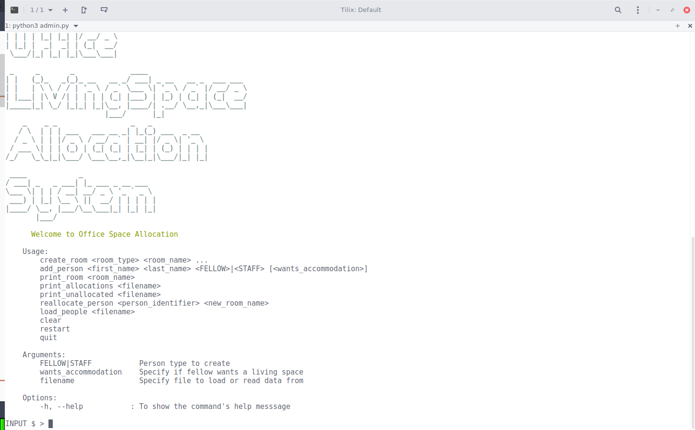
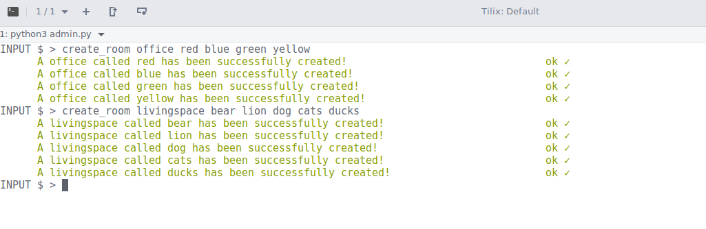
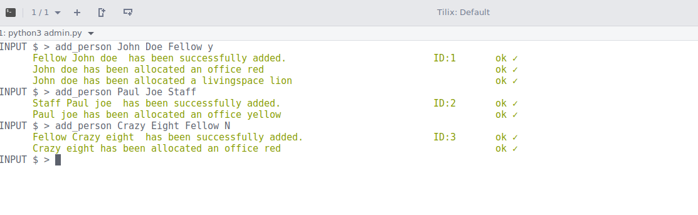

# Office And LivingSpace Allocation System
A Command line application that managers a dojo facillity. <br/>
It allocates rooms to new employees, [Staff or Fellow] randomly.
A room in the dojo can either be an `office` or a `livingspace`. Offices in the dojo can only accommodate 6 people whereas a livingspaces can only accommodate 4.

An employee can either be a `staff` or a `fellow`. Staff can only be assigned offices, whereas fellows can be assigned either or both, depending on there choice regarding a livingspace.

### Available Commands

*	```Adds_room name_room [office | living space]``` <br/>
*	```Adds_Person  firstname secondname [fellow| staff]``` <br/>
*	```Print_Allocations [filename] ``` <br/>
*	```print_Unallocated [filename]``` <br/>
*   ```reallocate_person  id  new_room```<br/>
*   ```load_people  file.txt``` <br/>


## Getting Started

* Create a virtual enviroment <br/>
* Find the instructions for installing and using a virtual environment and virtualenv wrapper [here](http://docs.python-guide.org/en/latest/dev/virtualenvs/).
* Git Clone this repo to your local machine.
```
git clone https://github.com/georgreenmanu/Geoogreen-Mamboleo-Dojo-Project.git
```


### Prerequisites

```
See requirements.txt
```
You have to install python3 to run this app

### Installing
After cloning the repo , cd to the folder, activate your virtual enviroment then:

```
pip install -r requirements.txt
``` 
Run the above command to install the app and required dependencies.

### Running the App

From your terminal you can now run the application by using the following command: 

```
python3 admin.py
```

A welcome screen will show as follows: 

   

You can now interact with application by entering the commands displayed above. <br/>
*NOTE:* Pressing the TAB key twice displays all the available commands

### Session Examples:
+ To create a room which is an office run the command `create room office red` or use `livingspace` to create a livingspace. You could also give a list of room names to create by separating the names with spaces as shown:

    

+ To add a person, use the command `add person Paul Joe staff` and for a fellow who wants a living space use `add person Jojn Doe fellow y`. 

    

    *NOTE:* the livingspace option only applies to fellows and not staff.

+ You can reallocate a person using the command `reallocate_person <id> <newroom>`.

+ You can load people from a file by using the `load_people file.txt` command.


+ You can also print out the allocated people and the unallocated using `print_[allocated|unallocated]` command, specifying the filename saves the allocations on the specified file. 

+ The command `print_room <room name>` print's room's occupants.

+ You could clear the screen if you wish by using the `clear` command.

+ To restart the app use the command `restart`

+ To quit the application run the `quit` command.


## Running the tests

```
nosetests

nosetests --with-coverage  
```
To run tests run the command above : Require's nosetests


## Built With

* [Docopt](http://docopt.org/) - command line argument parser
* [cmd](https://wiki.python.org/moin/CmdModule) - Tool for making command line tools.


## Version
version 3.0


## Authors

* **Georgreen Ngunga**


## License

This project is licensed under the MIT License - see the [LICENSE.md](LICENSE) file for details

## Acknowledgments

* [Stack Overflow](https://stackoverflow.com/)
* [The Hitchhiker’s Guide to Python!](http://python-guide-pt-br.readthedocs.io/en/latest/)

## Wish List
* Database support
